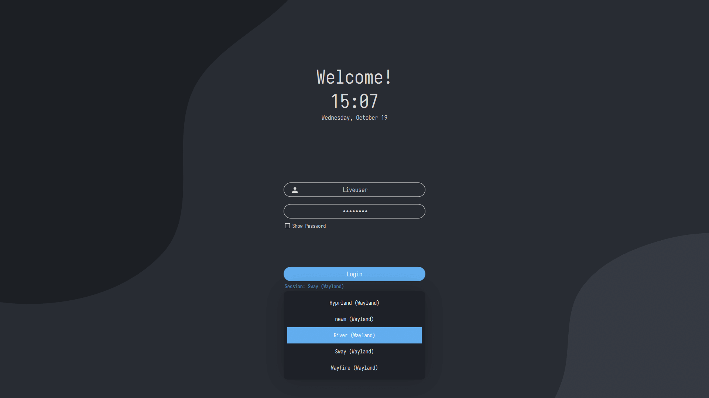

<b>Archcraft Wayland Special Edition : An Ultimate Wayland Compositors Experience</b>

  
  
  
  
  
  
  

---

### From Archcraft Wiki

- [Things To Do After Installing Archcraft](https://wiki.archcraft.io/docs/install-archcraft/post-install)
- [Install Archcraft With Calamares](https://wiki.archcraft.io/docs/install-archcraft/install-with-calamares)
- [Install Archcraft With ABIF](https://wiki.archcraft.io/docs/install-archcraft/install-with-abif)
- [Create A Bootable USB With Archcraft](https://wiki.archcraft.io/docs/boot-iso/boot-with-usb)
- [Boot Archcraft ISO With GRUB2 Bootloader](https://wiki.archcraft.io/docs/boot-iso/boot-with-grub)

### Overview
This special edition of Archcraft comes with [`Sway`](https://github.com/archcraft-os/archcraft-sway), [`Wayfire`](https://github.com/archcraft-os/archcraft-wayfire), [`River`](https://github.com/archcraft-os/archcraft-river), [`Hyprland`](https://github.com/archcraft-os/archcraft-hyprland) and [`Newm`](https://github.com/archcraft-os/archcraft-newm) pre-installed, pre-configured and provides you a wayland only Linux experience.

**1st ISO Generation :** `October 20th, 2022`  
**2nd ISO Generation :** `January 10th, 2023`  
**3rd ISO Generation :** `April 15th, 2023`  
**4th ISO Generation :** `May 6th, 2023`  
**5th ISO Generation :** `July 11th, 2023`  
**6th ISO Generation :** `October 15th, 2023`  
**Last Updated :** `October 15th, 2023`

<b>Changelogs</b>

### Changelog (October 2023) : 6th ISO
- Updated ISO profile
- Latest base with new packages
- Updated all wayland compositors
  - Added better example for multi-monitor support in...
    - Sway: `~/.config/sway/sway-output`
    - Wayfire: `~/.config/wayfire.ini`
    - River: `~/.config/river/init`
    - Hyprland: `~/.config/hypr/hyprland.conf`
    - Newm: `~/.config/newm/config.py`
- Added `wipe` ability in ABIF
- Fixed issue with `help and tips` app
- Small improvements and bugs fixed.

#

### Changelog (July 2023) : 5th ISO
- Updated ISO profile with latest archiso
- Latest base with new packages
- Fixed sddm not saving the last used session issue
- Added a calculator app
- Added Welcome and Help-and-Tips App
- Fixed Scaling issue in QT apps in wayland
- **`Sway, Wayfire, River, Hyprland`**
  - Added `bluetooth` module on Waybar
  - Added a rofi `bluetooth` applet
  - Added `alacritty` terminal
  - Added `pywal` support
  - Improved a lot of scripts
  - etc
- Many small bugs fixed.

#

### Changelog (May 2023) : 4th ISO
- Fixed pacman-init issue
- Added ability to choose desktop in the installer (calamares)
- Fixed auto-login issue
- etc

#

### Changelog (April 2023) : 3rd ISO
- Using `sddm-git` now, Solved shutdown/reboot issue
- Using new method to boot the ISO on Nvidia Machines
- Updated the Installers with (possible) Nvidia support
- Updated the base system with latest packages
- **`Updated All the wayland compositors`**
  - Updated the config structure
  - Added Rofi menu, applets and scripts (network, music, etc)
  - Fixed area screenshot overlay issue
  - Fixed nerwork-applet overlay issue in hyprland
  - Modified the configs for waybar, wlogout and wofi (added separate colors.css file)
  - Changes gtk themes in sway, wayfire and hyprland
  - Updated lockscreen script in sway
  - Added two packages for NEWM (one normal and one blur)
  - Added spotify module in waybar in all WCs
  - Animated MPD and spotify modules in waybar
- Many Bug fixes, etc

#

### Changelog (January 2023) : 2nd ISO
- Added ABIF (CLI) installer
- Updated the base system
- Updated All the compositors
- Bug fixes, etc

#

### Changelog (October 2022) : 1st ISO
- Created the ISO base from scratch
- Grub2 bootloader with themes
- Customized Plymouth & SDDM
- Basic Applications Only, No Bloatware
- Calamares Installer (Graphical)
- Full Network Manager Support, Various VPN plugins
- Built-in Bluetooth Support
- Pipewire For Sound/Audio (Systemwide, Bluetooth, Jack)
- Built-in Printer Support
- Almost All Audio, Video and Image Codecs
- Full File manager functionality (Mounting, Networking, Archiving, etc)
- Built-in AUR support
- Minimal User Interface
- Multiple Wayland Compositors (Sway, Wayfire, River, Hyprland, Newm)
- Archcraft Icons, Themes, Wallpapers, Fonts
- Etc

### Get The ISO

You can download the latest `ISO` from [ko-fi :coffee:](https://ko-fi.com/s/213becbf00).

> Default `username` and `password` is **liveuser**.

For Graphical Installation Instructions, See [Install Archcraft With Calamares](https://wiki.archcraft.io/docs/install-archcraft/install-with-calamares) 
For CLI (abif) Installation Instructions, See [Install Archcraft With ABIF](https://wiki.archcraft.io/docs/install-archcraft/install-with-abif)

---

**`WARNING : VM -`** This ISO does not work with **VMs (Virtualbox, VMware, Qemu, etc)**. I mean it does but... on some, you won't pass the login screen (SDDM) and on some, the compositors will be very laggy due to poor 3D support.

#
 

**`WARNING : Nvidia -`** There is no official support for Nvidia. Unfortunately, their drivers are so messy, and their products so random, that it’s impossible to help if the ISO don’t work on your machine. Every card seems to be random, and might work perfectly, or not work at all. However... 
The `lastest ISO (April 15th)` have everything configured **out-of-the-box**, Needed to run a _wayland compositor_ on **Nvidia**. It has all the needed modules enabled into `mkinitcpio.conf` and **initrd**, `Kernel parameters` are added, and the needed proprietary graphics drivers installed. 
Now, It's your choise to give it a try.

**Update:** As Reported, Users are able to boot and Install the Latest ISO (April) on their Nvidia Machines. Everything is working fine.

**More info :** [Sway Installation](https://wiki.archlinux.org/title/Sway#Installation), [Hyprland Nvidia](https://wiki.hyprland.org/Nvidia/), [wayland Requirements](https://wiki.archlinux.org/title/wayland#Requirements), [DRM_kernel_mode_setting](https://wiki.archlinux.org/title/NVIDIA#DRM_kernel_mode_setting), [NVIDIA#Installation](https://wiki.archlinux.org/title/NVIDIA#Installation)

#
 

**`WARNING : Iris XE -`** Some users reported that, This ISO does not work on systems with `Intel Iris XE` GPUs.

---

### Screenshots

<!-- Sway -->

<b>Sway</b>

| Screenshot 1 | Screenshot 2 | Screenshot 3 | Screenshot 4 |
| --- | --- | --- | --- |
|||||

<!-- Wayfire -->

<b>Wayfire</b>

| Screenshot 1 | Screenshot 2 | Screenshot 3 | Screenshot 4 | Screenshot 5 |
| --- | --- | --- | --- | --- |
||||||

<!-- River -->

<b>River</b>

| Screenshot 1 | Screenshot 2 | Screenshot 3 | Screenshot 4 |
| --- | --- | --- | --- |
|||||

<!-- Hyprland -->

<b>Hyprland</b>

| Screenshot 1 | Screenshot 2 | Screenshot 3 | Screenshot 4 |
| --- | --- | --- | --- |
|||||

<!-- NEWM -->

<b>Newm</b>

| Screenshot 1 | Screenshot 2 | Screenshot 3 | Screenshot 4 | Screenshot 5 |
| --- | --- | --- | --- | --- |
||||||

### Videos

| Sway | Wayfire | River | Hyprland | Newm |
| --- | --- | --- | --- | --- |
||||||

---

- For **Keybindings**, See `Help and Tips` app.
- I Hope you'll enjoy this flavor of Archcraft.
- Thank you for supporting Archcraft.
